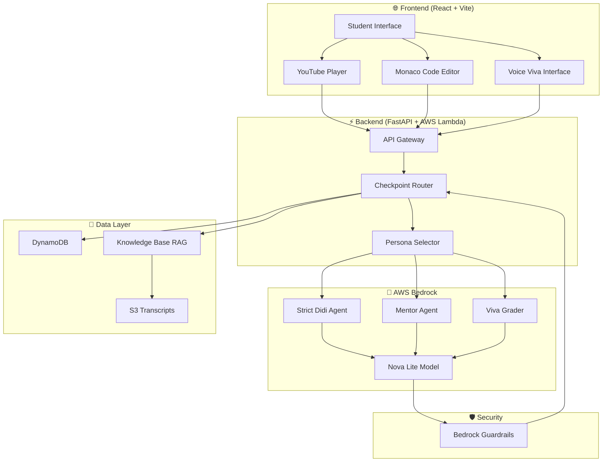

# 🚀 Project Orbit

> **An AI-powered learning arena that locks students into understanding — no shortcuts, no skipping, just pure comprehension.**

[](https://aws.amazon.com/)
[](https://fastapi.tiangolo.com/)
[](https://react.dev/)
[](LICENSE)

**Built for**: AWS AI Bharath Hackathon 2026  
**Team**: technorev 
**Demo**: [Live Demo Link]

---

## 🎯 The Problem

- **70%** of online learners never complete courses (Harvard/MIT study)
- **Tutorial Hell**: Students can explain concepts but can't code
- **600M+** internet users in India — largest EdTech market globally
- ₹50,000 crore Indian EdTech market → ₹1 lakh crore by 2030

**The Core Issue**: Passive video watching ≠ Active learning. Students hit play, zone out, and never truly understand.

---

## 💡 Our Solution

**Project Orbit** transforms passive video lectures into interactive coding arenas. The video **pauses at critical checkpoints** and won't resume until the student:

1. ✅ Writes correct code (validated by AI)
2. ✅ Passes an oral viva to prove understanding
3. ✅ Demonstrates conceptual mastery, not just memorization

### Key Innovation: Dual-Persona AI System

```
Attempt 1-2: 🔴 Strict Didi (Interrogator)
  → Harsh feedback, minimal hints
  → "Your logic is incorrect. Think about array boundaries."

Attempt 3+: 🟢 Mentor Mode
  → Empathetic guidance, visual diagrams
  → "Let me help you visualize this with a flowchart..."

Viva Phase: 🎤 Oral Assessment
  → AI asks follow-up questions via voice
  → Validates conceptual understanding
  → Blocks prompt injection with AWS Guardrails
```

---

## 🏗️ Architecture

### System Overview



### Tech Stack

| Layer | Technology | Purpose |
|-------|-----------|---------|
| **Frontend** | React 19 + Vite | Interactive UI with 3D space theme |
| **UI Components** | Monaco Editor, React Player, Framer Motion | Code editing, video playback, animations |
| **Backend** | FastAPI + Uvicorn | High-performance async API |
| **Deployment** | AWS Lambda + Mangum | Serverless compute |
| **AI Engine** | Amazon Bedrock (Nova Lite) | Multi-agent AI evaluation |
| **RAG** | Bedrock Knowledge Bases + S3 | Context-aware feedback from transcripts |
| **Database** | DynamoDB | Student progress tracking |
| **Security** | Bedrock Guardrails | Anti-cheat for viva answers |
| **Hosting** | AWS Amplify | Frontend deployment |

---

## 🎨 Features

### 1. **Checkpoint-Based Learning**
- Videos pause at critical moments
- Students must solve coding challenges to proceed
- No skipping, no shortcuts

### 2. **Adaptive AI Personas**
- **Strict Didi** (Attempts 1-2): Tough love, minimal hints
- **Mentor** (Attempts 3+): Supportive guidance with diagrams
- Automatic persona switching based on struggle

### 3. **Oral Viva Assessment**
- Voice-based conceptual questions
- Validates understanding beyond code
- Prevents copy-paste cheating

### 4. **Multi-Language Support**
- English, Hindi, Hinglish
- AI responds in student's preferred language
- Culturally adapted feedback

### 5. **Anti-Cheat System**
- AWS Guardrails block prompt injection
- Server-side code validation
- Viva questions require genuine understanding

### 6. **Immersive Space UI**
- 3D planet navigation (Three.js)
- Animated space background
- Gamified progress tracking

---

## 🚀 Quick Start

### Prerequisites

- Node.js 18+ and npm
- Python 3.9+
- AWS Account with Bedrock access
- AWS CLI configured

### Backend Setup

```bash
cd backend

# Install dependencies
pip install -r requirements.txt

# Configure AWS credentials
cp .env.example .env
# Edit .env with your AWS credentials

# Run locally
uvicorn main:app --reload --port 8000
```

### Frontend Setup

```bash
cd frontend/orbit-builder-2

# Install dependencies
npm install

# Configure API endpoint
# Edit src/api.js to point to your backend URL

# Run development server
npm run dev
```

### Environment Variables

Create `backend/.env`:

```env
AWS_DEFAULT_REGION=us-east-1
BEDROCK_MODEL_ID=us.amazon.nova-2-lite-v1:0
DYNAMO_TABLE_NAME=StudentProgress
S3_BUCKET=your-transcript-bucket
KNOWLEDGE_BASE_ID=your-kb-id
GUARDRAIL_ID=your-guardrail-id
GUARDRAIL_VERSION=DRAFT
USE_LOCAL_DB=true
```

---

## 📡 API Endpoints

### Health Check
```http
GET /health
```

### Get Student Progress
```http
GET /api/progress/{student_id}
```

### Get Day Curriculum
```http
GET /api/curriculum/{day_id}
```
Returns video details and checkpoint data for a specific day.

### Submit Code/Viva Answer
```http
POST /api/submit
Content-Type: application/json

{
  "checkpoint_id": "cp_01_array_iteration",
  "submission_type": "code",
  "attempt_count": 1,
  "language_preference": "hinglish",
  "user_code": "int[] prices = {250, 400, 150}; ..."
}
```

---

## 🎓 Curriculum Structure

Currently supports **3 days** of Java DSA content:

| Day | Topic | Video | Checkpoints |
|-----|-------|-------|-------------|
| **Day 1** | Arrays Basics | Arrays Introduction | 3 checkpoints |
| **Day 2** | Linked Lists | Introduction to Linked List | 3 checkpoints |
| **Day 3** | Stacks | Stack Data Structure | 3 checkpoints |

Each checkpoint includes:
- Timestamp-synced video pause
- Starter code template
- Expected concept validation
- Progressive difficulty

---

## 🧠 AI Agent System

### Persona Selection Logic

```python
if submission_type == "code":
    if attempt_count < 3:
        persona = "Strict Didi"  # Tough interviewer
    else:
        persona = "Mentor"       # Supportive guide
        
elif submission_type == "viva":
    if viva_attempt_count < 2:
        persona = "Strict Didi"
    else:
        persona = "Mentor"
```

### Prompt Engineering

Each persona has carefully crafted prompts:
- **Interrogator**: Strict compiler-like feedback, minimal hints
- **Mentor**: Empathetic explanations, visual diagrams (Mermaid)
- **Viva Grader**: Conceptual understanding validation

---

## 💰 Business Model

### B2B SaaS Pricing

| Customer Segment | Use Case | Pricing |
|------------------|----------|---------|
| Coaching Institutes | Embed Arena Mode in lectures | ₹5-15/student/month |
| Corporate Training | New hire assessment | ₹500/employee one-time |
| EdTech Platforms | White-label Viva system | Revenue share |
| Universities | Lab evaluation with anti-cheat | ₹2-5/student/month |

### Unit Economics (Per 1,000 Students/Month)

```
AWS Costs:
  • Bedrock Nova Lite:     ₹50
  • DynamoDB:              ₹0 (Free Tier)
  • Lambda:                ₹0 (Free Tier)
  • S3 + Knowledge Base:   ₹200
  ────────────────────────────
  Total Cost:              ₹250/month

Revenue (₹10/student):     ₹10,000/month
Gross Margin:              97.5%
```

---

## 🏆 Competitive Advantage

| Competitor | Limitation | Our Edge |
|------------|-----------|----------|
| ChatGPT / Copilot | Generic help, no curriculum | State-driven checkpoints |
| LeetCode | Practice only, no video | Integrated learning experience |
| Coding Ninjas | Passive courses | Forced active participation |
| **Project Orbit** | — | Video locks + Viva + Anti-cheat |

---

## 🛡️ Security Features

1. **AWS Bedrock Guardrails**: Blocks prompt injection attempts
2. **Server-Side Validation**: Code execution happens on backend
3. **Viva Authentication**: Voice-based conceptual validation
4. **Progress Tracking**: DynamoDB prevents checkpoint skipping

---

## 📊 AWS Services Used

- ☁️ **AWS Lambda**: Serverless API hosting
- 🤖 **Amazon Bedrock (Nova Lite)**: Multi-agent AI system
- 📚 **Bedrock Knowledge Bases**: RAG from video transcripts
- 🛡️ **Bedrock Guardrails**: Content filtering and anti-cheat
- 💾 **DynamoDB**: Student progress persistence
- 📦 **S3**: Transcript storage
- 🌐 **API Gateway**: RESTful API management
- 🚀 **Amplify**: Frontend hosting

---

## 🎬 Demo Flow

1. **Student logs in** → Sees space-themed dashboard with planets
2. **Selects Day 1** → Video starts playing
3. **Video pauses at checkpoint** → Code editor appears with starter code
4. **Student writes code** → Submits for AI evaluation
5. **Strict Didi responds** → "Your logic is incorrect. Think about boundaries."
6. **After 3 attempts** → Mentor provides visual diagram
7. **Code correct** → AI asks viva question via voice
8. **Student answers verbally** → Speech-to-text + AI evaluation
9. **Viva passed** → Video unlocks and continues
10. **Repeat** → Next checkpoint

---

## 📈 Impact Metrics

### Target Outcomes
- **Completion Rate**: 70% → 90% (vs traditional MOOCs)
- **Concept Retention**: 3x improvement (measured via viva pass rate)
- **Time to Proficiency**: 40% reduction in learning curve
- **Cheating Prevention**: 95% reduction vs honor-system platforms

### Scalability
- Serverless architecture → Auto-scales to millions
- Pay-per-use pricing → Zero idle costs
- Multi-language support → Pan-India reach

---

## 🔮 Future Roadmap

### Phase 1 (Post-Hackathon)
- [ ] Add 20+ more video courses (Python, JavaScript, React)
- [ ] Real-time leaderboards and peer comparison
- [ ] Mobile app (React Native)

### Phase 2 (Market Launch)
- [ ] B2B partnerships with coaching institutes
- [ ] Corporate training modules
- [ ] Certificate generation with blockchain verification

### Phase 3 (Scale)
- [ ] Multi-language video support (Tamil, Telugu, Bengali)
- [ ] AI-generated custom checkpoints from any video
- [ ] Adaptive difficulty based on student performance

---

## 🤝 Contributing

We welcome contributions! Please follow these steps:

1. Fork the repository
2. Create a feature branch (`git checkout -b feature/amazing-feature`)
3. Commit your changes (`git commit -m 'Add amazing feature'`)
4. Push to the branch (`git push origin feature/amazing-feature`)
5. Open a Pull Request

---

## 📄 License

This project is licensed under the MIT License - see the [LICENSE](LICENSE) file for details.

---

## 👥 Team

[Add your team member names and roles here]

- **Hanumaditya** - Full Stack Developer
- **Sri Hari** - AI/ML Engineer
- **Nehalika** - UI/UX Designer
- **Sagar Varma** - AWS Solutions Architect

---

## 🙏 Acknowledgments

- **AWS Bedrock Team** for Nova Lite model access
- **Bharath Hackathon Organizers** for this incredible opportunity
- **Open Source Community** for amazing tools and libraries

---

## 📞 Contact

- **Email**: sriharizbett@gmail.com
- **LinkedIn**: https://www.linkedin.com/in/sri-hari-48321b297/
- **GitHub**: https://github.com/Futurater

---

<div align="center">

**Built with ❤️ using AWS AI Services**

*Transforming passive learning into active mastery, one checkpoint at a time.*

</div>
